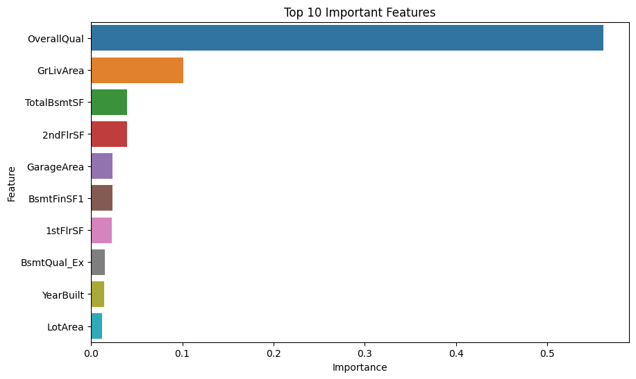
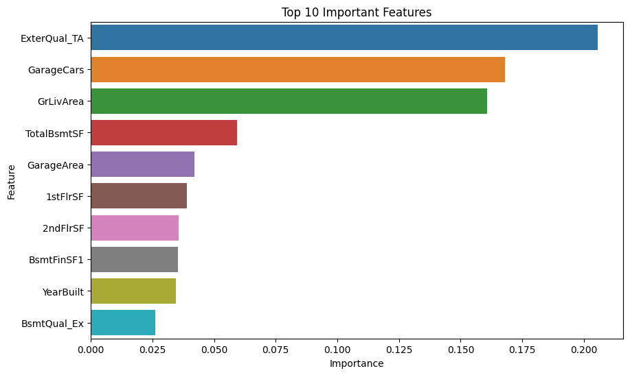
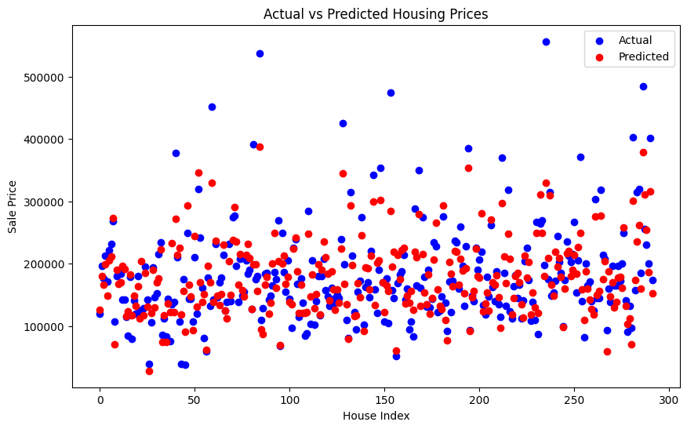
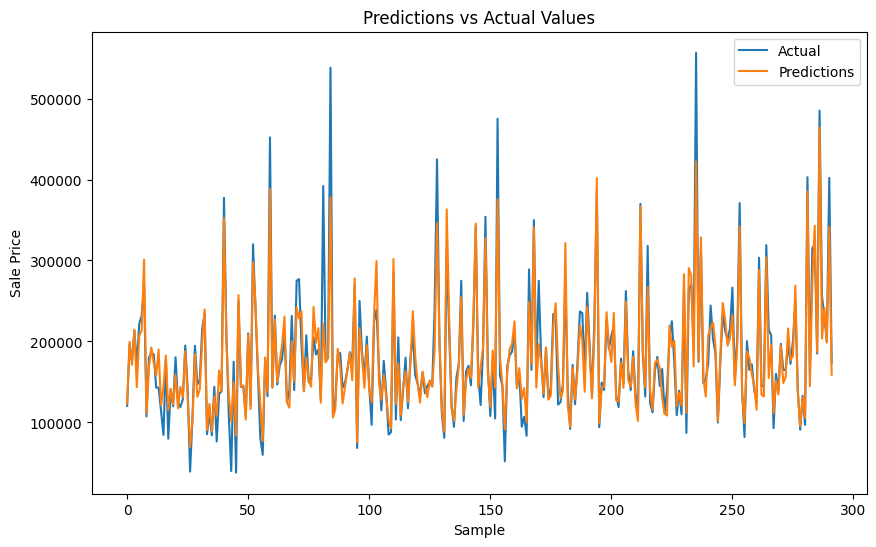
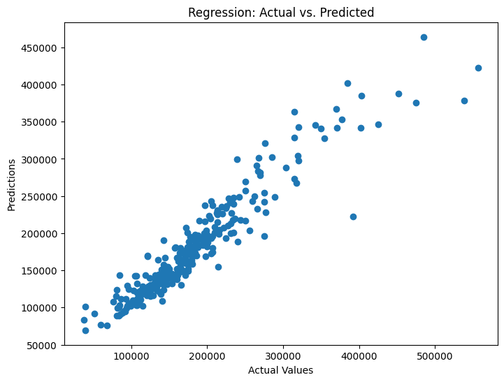

# Housing_Predicitons
---

## Introduction

The objective of this project is to develop a predictive model that can accurately estimate housing prices. The model will be implemented using Python and will leverage data retrieved from Spark. By analyzing and optimizing the model, we aim to achieve a classification accuracy of at least 75% or an R-squared value of 0.80.

## Data Model Implementation

To initiate the project, we will develop a Python script that initializes, trains, and evaluates the predictive model. This script will serve as the foundation for our housing price prediction model. Additionally, we will focus on cleaning, normalizing, and standardizing the data before feeding it into the model. This ensures that the data is consistent and suitable for accurate predictions. Moreover, we will retrieve the necessary data from Spark, depending on availability and feasibility.

Source: [House Prices: Advanced Regression Techniques](https://www.kaggle.com/competitions/house-prices-advanced-regression-techniques/overview)

File Names:
- Train: `train.csv`
- Test: `test.csv`

## Purpose Points

1. **Accurate Estimation:** The model allows for accurate estimation of housing prices, providing potential buyers, sellers, and real estate professionals with a reliable tool to assess property values. This can aid in making informed decisions regarding buying, selling, or investing in real estate.

2. **Market Analysis:** By analyzing historical data and current trends, the model can provide insights into the housing market. It will help identify patterns, factors, and variables that influence housing prices, enabling a deeper understanding of market dynamics and assisting in strategic planning.

3. **Risk Management:** The model can contribute to risk assessment and management. Lenders and financial institutions can utilize the predictions to evaluate the feasibility of mortgage loans, assess property valuations, and mitigate risks associated with lending.


### Data Fields

#### Location and Property

| Description      | Data Field    |
|------------------|---------------|
| The building class | MSSubClass   |
| The general zoning classification | MSZoning |
| Linear feet of street connected to property | LotFrontage |
| Lot size in square feet | LotArea |
| Type of road access | Street |
| Type of alley access | Alley |
| General shape of property | LotShape |
| Flatness of the property | LandContour |
| Type of utilities available | Utilities |
| Lot configuration | LotConfig |
| Slope of property | LandSlope |
| Physical locations within Ames city limits | Neighborhood |

#### Condition and Quality

| Description | Data Field |
|-------------|------------|
| Overall material and finish quality | OverallQual |
| Overall condition rating | OverallCond |
| Exterior material quality | ExterQual |
| Present condition of the material on the exterior | ExterCond |
| Height of the basement | BsmtQual |
| General condition of the basement | BsmtCond |
| Walkout or garden level basement walls | BsmtExposure |
| Quality of basement finished area | BsmtFinType1 |
| Quality of second finished area (if present) | BsmtFinType2 |
| Heating quality and condition | HeatingQC |
| Central air conditioning | CentralAir |
| Electrical system | Electrical |
| Kitchen quality | KitchenQual |
| Fireplace quality | FireplaceQu |
| Garage quality | GarageQual |
| Garage condition | GarageCond |
| Pool quality | PoolQC |
| Fence quality | Fence |
| Miscellaneous feature not covered in other categories | MiscFeature |

#### Construction and Building Features

| Description | Data Field |
|-------------|------------|
| Type of dwelling | BldgType |
| Style of dwelling | HouseStyle |
| Original construction date | YearBuilt |
| Remodel date | YearRemodAdd |
| Type of roof | RoofStyle |
| Roof material | RoofMatl |
| Exterior covering on house | Exterior1st |
| Exterior covering on house (if more than one material) | Exterior2nd |
| Masonry veneer type | MasVnrType |
| Masonry veneer area in square feet | MasVnrArea |
| Type of foundation | Foundation |
| Type of heating | Heating |
| First Floor square feet | 1stFlrSF |
| Second floor square feet | 2ndFlrSF |
| Low-quality finished square feet (all floors) | LowQualFinSF |
| Above grade (ground) living area square feet | GrLivArea |
| Basement full bathrooms | BsmtFullBath |
| Basement half bathrooms | BsmtHalfBath |
| Full bathrooms above grade | FullBath |
| Half baths above grade | HalfBath |
| Number of bedrooms above basement level | Bedroom |
| Number of kitchens | Kitchen |
| Total rooms above grade (does not include bathrooms) | TotRmsAbvGrd |
| Number of fireplaces | Fireplaces |
| Garage location | GarageType |
| Year garage was built | GarageYrBlt |
| Interior finish of the garage | GarageFinish |
| Size of the garage in car capacity | GarageCars |
| Size of the garage in square feet | GarageArea |
| Paved driveway | PavedDrive |

#### Outdoor Features

| Description | Data Field |
|-------------|------------|
| Wood deck area in square feet | WoodDeckSF |
| Open porch area in square feet | OpenPorchSF |
| Enclosed porch area in square feet | EnclosedPorch |
| Three-season porch area in square feet | 3SsnPorch |
| Screen porch area in square feet | ScreenPorch |
| Pool area in square feet | PoolArea |
| $Value of miscellaneous feature | MiscVal |
| Month Sold | MoSold |
| Year Sold | YrSold |
| Type of sale | SaleType |
| Condition of sale | SaleCondition |


### Required Libraries

To run this project, you will need the following Python libraries:

```python
import tensorflow as tf
import tensorflow_decision_forests as tfdf
import pandas as pd
import seaborn as sns
import numpy as np
from sklearn.model_selection import train_test_split
from sklearn.preprocessing import OneHotEncoder
from sklearn.metrics import mean_squared_error, mean_absolute_error, r2_score
from sklearn.impute import SimpleImputer
from sklearn.ensemble import RandomForestRegressor
import matplotlib.pyplot as plt
import xgboost as xgb
```
### Finding Category importance:

After conducting the feature importance analysis, we found that the "Overall Quality" feature holds the highest importance in predicting housing prices. This feature plays a crucial role as it encompasses a combination or "package" of many attributes that significantly influence the overall value of a home.

On the other hand, the remaining features have relatively lower contributions to the pricing influence of the home. While they do play a part in determining the housing price, their impact is relatively smaller compared to the comprehensive nature of the "Overall Quality" feature.

This insight highlights the significance of considering the overall quality of a property when assessing its value, as it captures various essential attributes that contribute to the final housing price prediction.


|   | Feature     | Importance |
|---|-------------|------------|
| 3 | OverallQual | 0.561596   |
| 15| GrLivArea   | 0.100940   |
| 11| TotalBsmtSF | 0.039790   |
| 13| 2ndFlrSF    | 0.039501   |
| 26| GarageArea  | 0.023761   |
| 8 | BsmtFinSF1  | 0.023415   |
| 12| 1stFlrSF    | 0.022913   |
| 182| BsmtQual_Ex | 0.014779   |
| 5 | YearBuilt   | 0.014215   |
| 2 | LotArea     | 0.011893   |


### Feature Importance without Overall Quality

|   | Feature       | Importance |
|---|---------------|------------|
|170| ExterQual_TA  | 0.205617   |
|24 | GarageCars    | 0.167884   |
|14 | GrLivArea     | 0.160604   |
|10 | TotalBsmtSF   | 0.059393   |
|25 | GarageArea    | 0.041994   |
|11 | 1stFlrSF      | 0.038869   |
|12 | 2ndFlrSF      | 0.035725   |
|7  | BsmtFinSF1    | 0.035475   |
|4  | YearBuilt     | 0.034599   |
|181| BsmtQual_Ex   | 0.026072   |

In the provided feature importance tables, the key observation is that "Overall Quality" has the highest impact on predicting housing prices, with a score of 0.561596. Other attributes, such as "GrLivArea" and "TotalBsmtSF," also contribute significantly but to a lesser extent. The second table, excluding "Overall Quality," highlights the prominence of "ExterQual_TA," "GarageCars," and "GrLivArea" in influencing housing prices. Overall, considering multiple factors is crucial for accurate predictions, benefiting buyers, sellers, and real estate professionals in decision-making.

---
# Using Random Forest

We achieved the following results:

### Top 10 Features with Importance (Including Overall Quality)




1. **Mean Squared Error (MSE):** 722083535.6865124
2. **Mean Absolute Error (MAE):** 17063.372939854453
3. **R-squared (R2) Score:** 0.8876849575352795

The model's performance evaluation shows that it has achieved an R-squared score of 0.89, indicating that approximately 89% of the variance in housing prices can be explained by the features used in the model. The Mean Squared Error (MSE) is 722083535.69, and the Mean Absolute Error (MAE) is 17063.37. The results suggest that the model is performing well but could benefit from further improvement to reduce the prediction errors.

# Using Random Forest without Overall Quality

### Taking away the "overalQual"
### Make predictions for validation set

```python
val_predictions = model.predict(val_features_encoded_imputed)

plt.figure(figsize=(10, 6))

# Plot the actual target values
plt.scatter(range(len(val_target)), val_target, color='blue', label='Actual')

# Plot the predicted target values
plt.scatter(range(len(val_predictions)), val_predictions.flatten(), color='red', label='Predicted')

plt.title('Actual vs Predicted Housing Prices')
plt.xlabel('House Index')
plt.ylabel('Sale Price')
plt.legend()
plt.show()


# Evaluate the model
mse = mean_squared_error(val_target, val_predictions)
mae = mean_absolute_error(val_target, val_predictions)
r2 = r2_score(val_target, val_predictions)

# Print the evaluation metrics
print("Mean Squared Error (MSE):", mse)
print("Mean Absolute Error (MAE):", mae)
print("R-squared (R2) Score:", r2)
```
### Top 10 Features with Importance (Excluding Overall Quality)



1. **Mean Squared Error (MSE):** 1696397433.4777012
2. **Mean Absolute Error (MAE):** 28305.44269718536
3. **R-squared (R2) Score:** 0.736137246784133

## Model Comparison: Evaluation Metrics

When comparing the performance of two predictive models for housing price estimation, we obtained the following evaluation metrics:

### Model 1:

### Actual vs. Predicted Plot with Overall Quality



- **Mean Squared Error (MSE):** 722083535.69
- **Mean Absolute Error (MAE):** 17063.37
- **R-squared (R2) Score:** 0.89

Model 1 demonstrates superior performance with a lower MSE and MAE, indicating that its predictions are closer to the true values. The higher R-squared score (0.89) suggests that Model 1 explains approximately 89% of the variance in housing prices, making it a better fit to the data.


### Model 2:

### Actual vs. Predicted Plot without Overall Quality



- **Mean Squared Error (MSE):** 1696397433.48
- **Mean Absolute Error (MAE):** 28305.44
- **R-squared (R2) Score:** 0.74

In contrast, Model 2 exhibits higher MSE and MAE values, indicating less accurate predictions compared to Model 1. The lower R-squared score (0.74) suggests that Model 2 explains only about 74% of the variance in housing prices.

In summary, Model 1 outperforms Model 2 in all evaluation metrics, demonstrating its superior accuracy and reliability in predicting housing prices.


### Regression Scatter Plot




